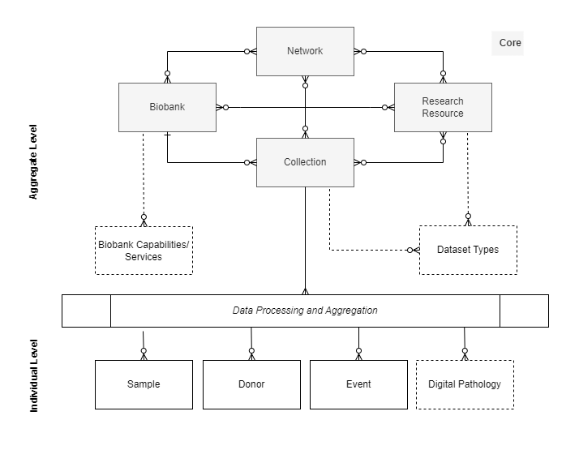

# MIABIS: Minimum Information About BIobank data Sharing

The Minimum Information About Biobank Data Sharing (MIABIS) initiative aims to standardize the description of biobanks, biosamples for research, and associated data, fostering interoperability among biobanks sharing information. MIABIS Core 2.0 defined general attributes for biobanks, sample collections, and studies at an aggregated metadata level. Additionally, MIABIS has introduced components, approved by BBMRI-ERIC, focusing on individual-level descriptions of samples and sample donors.

The MIABIS governance model, established by BBMRI-ERIC in 2016, organizes the work on definitions into focused components, each with a predefined scope based on specific use cases and involving working groups with participants from BBMRI-ERIC National Nodes and domain experts. The final approval of MIABIS components and entities rests with the BBMRI-ERIC Management Committee.

The MIABIS data standard is constantly being updated. Please feel free, to join our work and get into contact via miabis@lists.bbmri-eric.eu. If you have any issues, you would like the MIABIS team to consider, please submit them as an **ISSUE** to this GitHub page.

## MIABIS Core
The MIABIS Core, crucial for initiating collaboration and enabling sample and data exchange, comprises four main entities: Biobank, Collection, Research Resource, and Network. MIABIS Core 3.0 ([Eklund et al., 2024](https://www.liebertpub.com/doi/full/10.1089/bio.2023.0074)) further refines these attributes, providing a modular structure for easy adherence and extension. 
* [Data describing Biobank](00Core/V3/Data-describing-Biobank.md)
* [Data describing Collection](00Core/V3/Data-describing-Collection.md)
* [Data describing Network](00Core/V3/Data-describing-Network.md)
* [Data describing Research Resource](00Core/V3/Data-describing-ResearchResource.md)

## MIABIS aggregate-level components 

Two additional aggregate-level components have been prepared for Imaging (DICOM-MIABIS) and for Standard Operating Prodecures (SOPs). Ongoing developments include additional components describing dataset types and biobank capabilities, contributing to the continuous evolution of the MIABIS data standard.
* Data describing Image Collections ([Scapicchio et al., 2021](https://eurradiolexp.springeropen.com/articles/10.1186/s41747-021-00214-4)).
* [Data describing Dataset Types](DatasetTypes/README.md) - under active development
* [Data describing Biobank Services](BiobankServices/README.md) - under active development
* Data describing SOPs (in preparation)

## MIABIS individual-level components
In response to the need for more detailed information, MIABIS has extended its terminology to include individual-level components, describing samples, sample donors, and events. These entities enhance the ability to perform sophisticated queries. Ongoing developments include an additional component describing molecular pathology.

Data describing Sample, Sample Donor and Event v1.0 ([Eklund et al., 2020](https://doi.org/10.1089/bio.2019.0129))
* [Data describing Sample](Sample+SampleDonor+Events/V1/Data-describing-Sample.md)
* [Data describing Sample Donor](Sample+SampleDonor+Events/V1/Data-describing-Sample-Donor.md)
* [Data describing Event](Sample+SampleDonor+Events/V1/Data-describing-Event.md)

[Data describing Digital Pathology](DigitalPathology/README.md) - under active development

## All attributes, structured data and lists
* [all attributes](https://github.com/BBMRI-ERIC/miabis/blob/8deeead2e8e5c8c3faa42761db2939d523be21e3/all%20attributes.md)
* [all structured data](https://github.com/BBMRI-ERIC/miabis/blob/8deeead2e8e5c8c3faa42761db2939d523be21e3/all%20structured%20data.md) 
* [all lists]

## MIABIS Entity-Relationship Diagram
The MIABIS Entity-Relationship Diagram represents relationships between different MIABIS Components and entities included in those components.

### Product Owners 
The MIABIS standard is constantly evolving and we welcome your feedback. You can reach us at the collective email address miabis@lists.bbmri-eric.eu. - If you have specific questions, please directly address the following responsibles. 
 - MIABIS in general - Niina Eklund (and Cäcilia Engels)
 - Core - Cäcilia Engels
 - Sample, Donor and Event - Niina Eklund
 - Dataset Types - Gabi Anton (with: Omics - Kaisa Silander; Imaging - Heimo Müller) 
 - Digital Pathology - Heimo Müller
 - Biobank Services - Andrzej Strug
 - Data models and implementations - Michael Neumann

## MIABIS Use Cases & Implementations
 - BBMRI-ERIC Directory https://directory.bbmri-eric.eu/
 - BBMRI-ERIC Federated Search https://locator.bbmri-eric.eu/
 - GBN Sample Locator https://samplelocator.bbmri.de/
 
### Machine readable implementations
* [OpenSpecimen MIABIS v3 integration](https://github.com/BiobankCy/MIABIS_v3_OpenSpecimen_Integration)
* [Database implementation](Database-implementation.md)
* [MIABIS on FHIR](https://simplifier.net/miabis/~resources?category=Profile) or on GitHub: https://github.com/BBMRI-cz/miabis-on-fhir
* [Medical Informatics Initiative Germany: FHIR Core Data Set Modul Biobank/Biosample](https://simplifier.net/medizininformatikinitiative-modulbiobank)

## Quality Check Script Extensions:
Repository for scripts to support the operations of the BBMRI-ERIC Directory
* [molgenis-app-bbmri-eric-scripts](https://github.com/esthervanenckevort/molgenis-app-bbmri-eric-scripts)
