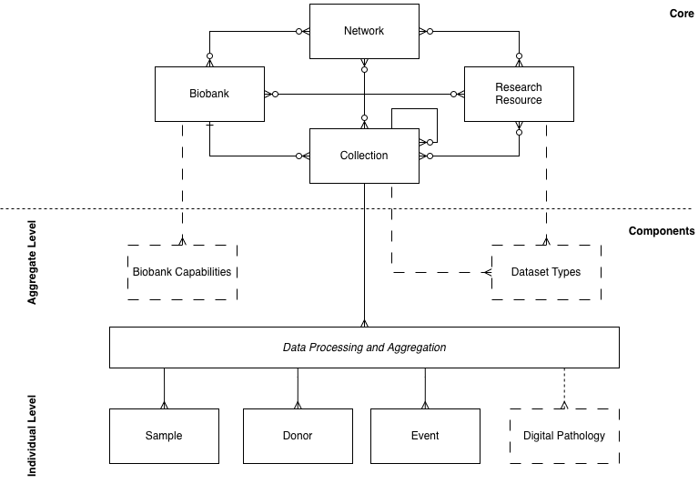

# MIABIS: Minimum Information About BIobank data Sharing

Welcome to MIABIS, the Minimum Information About Biobank data Sharing initiative! MIABIS is dedicated to standardising the data used to describe biobanks, research on samples, and associated data. Our goal is to enhance interoperability among biobanks sharing their valuable data and samples.

MIABIS 2.0, established by [Merino-Martinez et al. in 2016](https://www.liebertpub.com/doi/abs/10.1089/bio.2015.0070), defined general attributes at an aggregated level for describing biobanks, sample collections, and (research) studies. Building upon this foundation, new MIABIS components have been added to describe samples and sample donors at the individual level ([Eklund et al., 2020](https://doi.org/10.1089/bio.2019.0129)).

MIABIS was updated to version 3.0 by [Eklund et al. in 2024](https://www.liebertpub.com/doi/full/10.1089/bio.2023.0074) including minimal information describing biobanks, (sample and data) collections, research resources (previously called studies) and networks – on an aggregate level.

The MIABIS standard is constantly evolving and we welcome your feedback. Please feel free to join our work and get in touch via our mailing list at <miabis@lists.bbmri-eric.eu>. If you have any issues you would like the MIABIS team to consider, please submit them through [this Github repository](https://github.com/BBMRI-ERIC/miabis/issues).

## Structure

MIABIS is made up of different components, modelling a different biobanking-related entity (e.g. a biobank, a sample). These components consist of several attributes, each of which describes an aspect of the component. An overview of the different attributes and the relations between them is shown in the diagram below.

The four attributes in the top part of the diagram, Network, Biobank, Collection, and Research Resource, form the basis of MIABIS, the so-called Core. Building on this core are the other components, which apply to both the aggregate-level (e.g. Dataset Types) and the individual level (e.g. Sample). 

In addition to components and attributes, there are also structured data and value lists. Structured data are groups of attributes which are used across different entities and allow for a more detailed description of specific aspects of an entity, e.g. contact information or a disease. Value lists are used to constrain the possible values for certain attributes, e.g. to provide a pre-defined set of sample types or storage temperatures when describing a sample.

### Components
The MIABIS Core consists of four components: [Biobank](Core/Biobank.md), [Collection](Core/Collection.md), [Network](Core/Network.md), and [Research Resource](Core/Research%20Resource.md). On top of this, there is an aggregate-level component [Services](Services/Services.md), which describes services offered by biobanks. For imaging (DICOM-MIABIS), three Digital Pathology components have been developed: [Assay](Digital%20Pathology/Assay.md), [File](Digital%20Pathology/File.md), and [Scan](Digital%20Pathology/Scan.md).

On the individual level...

## MIABIS individual level components

In response to the need for more detailed information, MIABIS has extended its terminology to include individual- evel components, describing samples, sample donors, and events. These entities enhance the ability to perform sophisticated queries. Ongoing developments include an additional component describing molecular pathology.

Data describing Sample, Sample Donor, and Event v1.0 ([Eklund et al., 2020](https://doi.org/10.1089/bio.2019.0129))

* [Data describing Sample](https://github.com/BBMRI-ERIC/miabis/blob/5a478a90ad31bc0164d76566ee3d948c76a925a6/Sample%2BSampleDonor%2BEvent/V1/Data-describing-Sample.md)
* [Data describing Sample Donor](https://github.com/BBMRI-ERIC/miabis/blob/5a478a90ad31bc0164d76566ee3d948c76a925a6/Sample%2BSampleDonor%2BEvent/V1/Data-describing-Sample-Donor.md)
* [Data describing Event](https://github.com/BBMRI-ERIC/miabis/blob/5a478a90ad31bc0164d76566ee3d948c76a925a6/Sample%2BSampleDonor%2BEvent/V1/Data-describing-Event.md)

Data describing Digital Pathology ([DigitalPathology/README.md](https://github.com/BBMRI-ERIC/miabis/blob/master/DigitalPathology/README.md)) - under active development

### Structured Data

Sub-header too much? List all of them or not?

### Value Lists

Sub-header too much? List all of them or not?

## Governance

The MIABIS governance model, established by BBMRI-ERIC in 2016, organizes the work on definitions into focused components, each with a predefined scope based on specific use cases and involving working groups with participants from BBMRI-ERIC National Nodes and domain experts. The final approval of MIABIS components and entities rests with the BBMRI-ERIC Management Committee. Responsibility for specific components rests with the product owners:

* MIABIS in general - Niina Eklund (and Cäcilia Engels)
* Core - Cäcilia Engels
* Sample, Donor and Event - Niina Eklund
* Dataset Types - Gabi Anton (with: Omics - Kaisa Silander; Imaging - Heimo Müller)
* Digital Pathology - Heimo Müller
* Biobank Services - Andrzej Strug
* Data models and implementations - Michael Neumann

## Use Cases

* BBMRI-ERIC Directory <https://directory.bbmri-eric.eu/>
* BBMRI-ERIC Federated Search <https://locator.bbmri-eric.eu/>
* GBN Sample Locator <https://samplelocator.bbmri.de/>

## Machine-Readable Implementations

* [DICOM-MIABIS integration model for biobanks by Scapicchio et al., 2021](https://eurradiolexp.springeropen.com/articles/10.1186/s41747-021-00214-4)
  
* [OpenSpecimen MIABIS v3 integration](https://github.com/BiobankCy/MIABIS_v3_OpenSpecimen_Integration)

* [FHIRised MIABIS](https://simplifier.net/miabis/~resources?category=Profile) or on GitHub: <https://github.com/BBMRI-cz/miabis-on-fhir>

* [Medical Informatics Initiative Germany: FHIR Core Data Set Modul Biobank/Biosample](https://simplifier.net/medizininformatikinitiative-modulbiobank)
